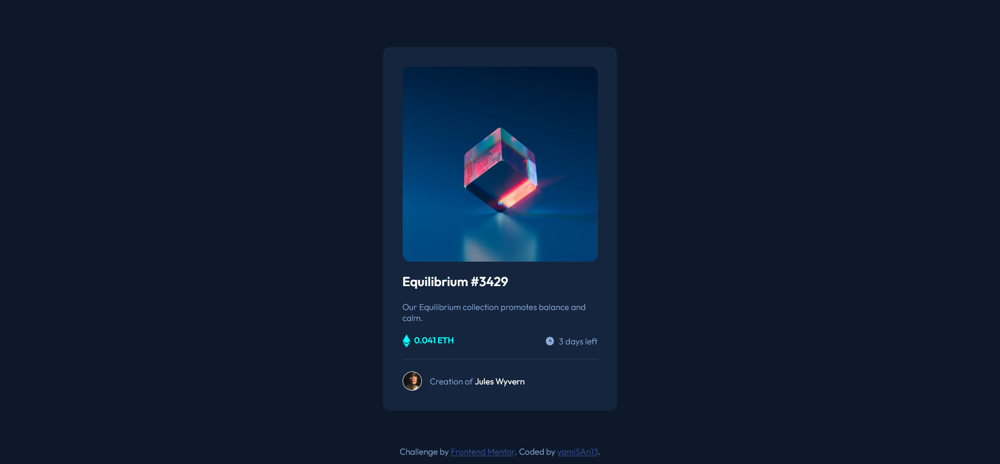

# Frontend Mentor - NFT preview card component solution

This is a solution to the [NFT preview card component challenge on Frontend Mentor](https://www.frontendmentor.io/challenges/nft-preview-card-component-SbdUL_w0U). Frontend Mentor challenges help you improve your coding skills by building realistic projects. 

## Table of contents

  - [The challenge](#the-challenge)
  - [Screenshot](#screenshot)
  - [Built with](#built-with)
  - [Useful resources](#useful-resources)
- [Author](#author)

### The challenge

Users should be able to:

- View the optimal layout depending on their device's screen size
- See hover states for interactive elements

### Screenshot

### Built with

- Semantic HTML5 markup
- CSS custom properties
- Flexbox

### Useful resources

- [freeCodeCamp](https://freecodecamp.org) - This helped me to understand Flex Box, Positioning, Responsive Web Design.
- [Elzero Web School](https://elzero.org/) - This helped me to deploy this challenge and submit it.

## Author

- Frontend Mentor - [@yamiSan1](https://www.frontendmentor.io/profile/yamiSan1)